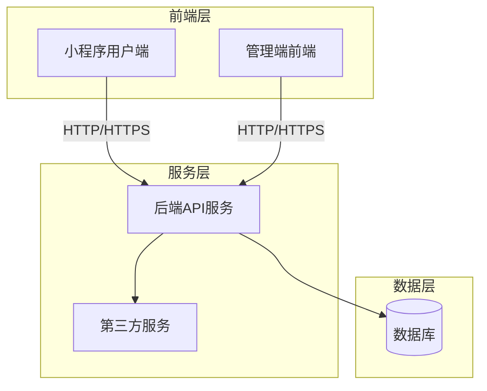
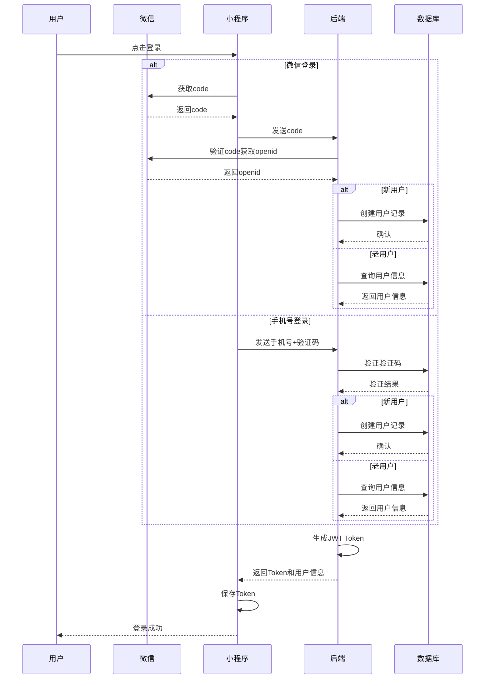
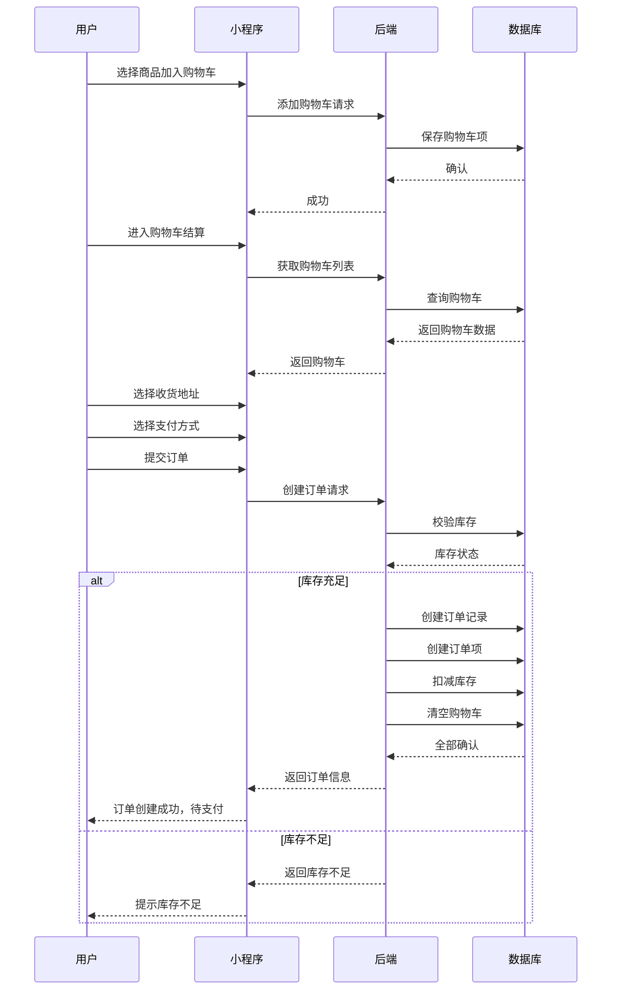
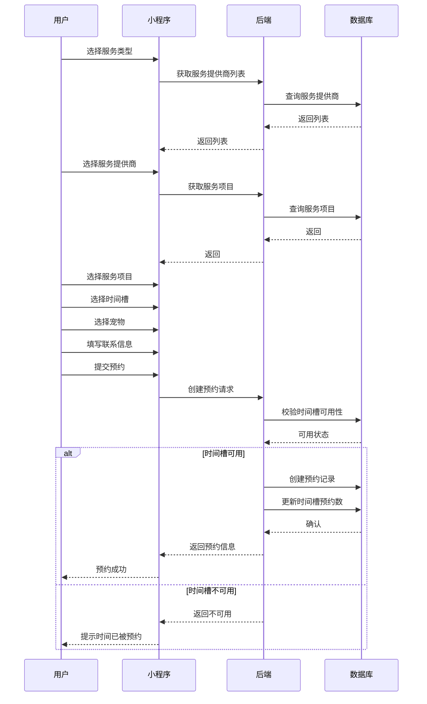
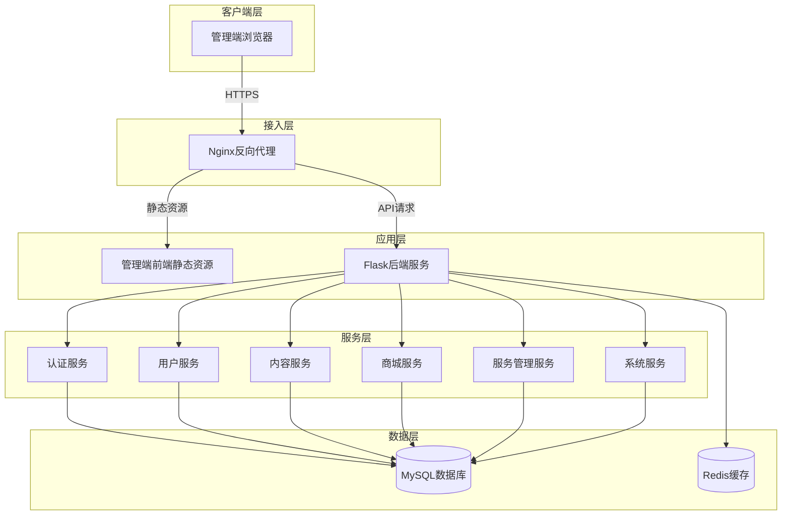
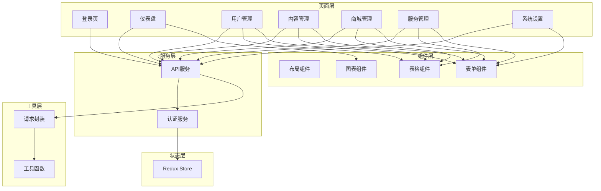
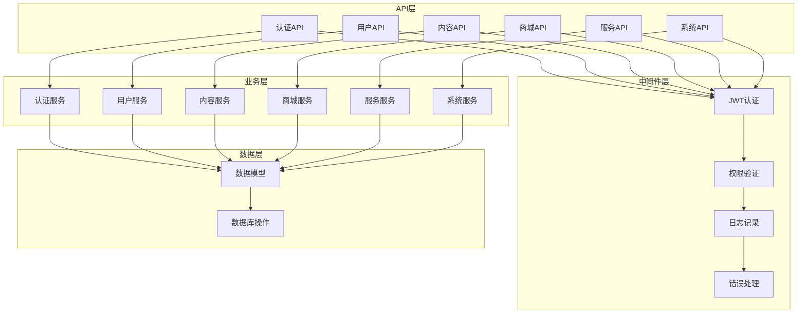
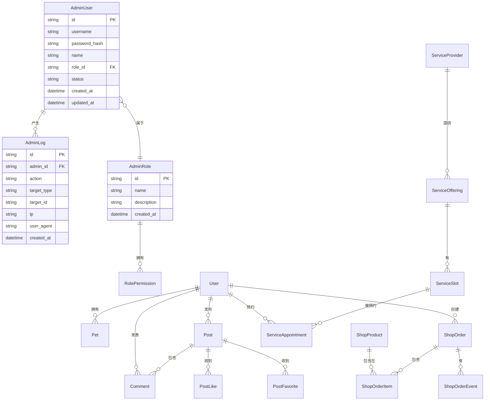
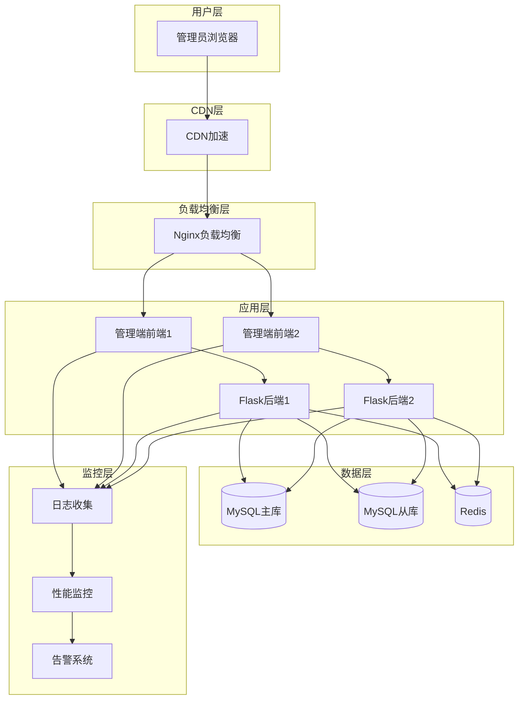

# 爱宠家小程序网页管理端需求与架构文档

---

## 版本控制

| 版本 | 日期 | 作者 | 变更说明 |
|-----|------|------|---------|
| v1.0 | 2026-04-01 | 项目组 | 初始版本，完整的需求与架构文档 |

---

## 变更记录

| 日期 | 变更人 | 变更内容 | 版本 |
|------|--------|---------|------|
| 2026-04-01 | 项目组 | 文档创建 | v1.0 |

---

## 术语表

| 术语 | 说明 |
|-----|------|
| 小程序 | 微信小程序，用户端应用 |
| 管理端 | 网页管理后台，供运营人员使用 |
| JWT | JSON Web Token，用于身份认证 |
| RBAC | Role-Based Access Control，基于角色的访问控制 |
| ORM | Object-Relational Mapping，对象关系映射 |
| API | Application Programming Interface，应用程序接口 |

---

## 1. 项目概述

### 1.1 项目背景

爱宠家是一个基于微信小程序的宠物社区应用，集社区交流、商品购买、宠物服务与个人中心于一体。随着用户量和业务量的增长，需要一个功能完善的网页管理端来支持运营管理工作。

### 1.2 项目目标

- 提供直观高效的管理界面，支持日常运营工作
- 实现用户、内容、商品、服务等核心业务的管理
- 提供数据分析和统计功能，支持决策
- 确保系统安全、稳定、可扩展

### 1.3 适用范围

本文档适用于爱宠家小程序网页管理端的需求分析、设计、开发、测试和部署。

---

## 2. 现有项目分析

### 2.1 现有项目架构

#### 2.1.1 整体架构



#### 2.1.2 技术栈

**小程序前端：**
- 微信小程序原生框架
- TypeScript
- 自定义组件

**后端：**
- Flask 微服务框架
- SQLAlchemy ORM
- SQLite/MySQL 数据库
- JWT 认证

**现有管理端技术选型（推荐）：**
- 前端：React 18 + TypeScript + Ant Design Pro
- 后端：复用现有 Flask 后端，新增管理端 API

### 2.2 现有前端核心代码分析

#### 2.2.1 项目结构

```
PawHome/miniprogram/
├── pages/              # 页面目录
│   ├── home/          # 首页
│   ├── community/     # 社区
│   ├── shop/          # 商城
│   ├── service/       # 服务
│   ├── vaccine/       # 疫苗
│   └── my/            # 个人中心
├── services/          # API服务封装
│   ├── auth.ts        # 认证服务
│   ├── user.ts        # 用户服务
│   ├── posts.ts       # 帖子服务
│   ├── shop.ts        # 商城服务
│   └── ...
└── app.json           # 小程序配置
```

#### 2.2.2 核心功能模块

**1. 用户模块**
- 用户登录/注册（手机号、微信）
- 用户信息管理
- 宠物档案管理
- 关注/粉丝关系

**2. 社区模块**
- 帖子浏览、发布、编辑
- 点赞、收藏、评论
- 内容搜索

**3. 商城模块**
- 商品浏览、详情
- 购物车管理
- 订单创建、支付、物流
- 钱包充值

**4. 服务模块**
- 服务提供商浏览
- 服务预约
- 疫苗记录管理
- 疫苗提醒

### 2.3 现有后端核心代码分析

#### 2.3.1 项目结构

```
backend/
├── app/
│   ├── api/v1/        # API v1 版本
│   │   ├── auth.py    # 认证接口
│   │   ├── users.py   # 用户接口
│   │   ├── posts.py   # 帖子接口
│   │   ├── shop.py    # 商城接口
│   │   ├── services.py # 服务接口
│   │   └── vaccines.py # 疫苗接口
│   ├── models.py      # 数据模型
│   └── config.py      # 配置
└── instance/          # 数据库文件
```

#### 2.3.2 核心数据模型

**用户相关：**
- `User`：用户信息
- `Pet`：宠物信息
- `Follow`：关注关系

**社区相关：**
- `Post`：帖子
- `Comment`：评论
- `PostLike`：点赞
- `PostFavorite`：收藏

**商城相关：**
- `ShopProduct`：商品
- `ShopOrder`：订单
- `CartItem`：购物车
- `Address`：收货地址

**服务相关：**
- `ServiceProvider`：服务提供商
- `ServiceAppointment`：服务预约
- `VaccineRecord`：疫苗记录

### 2.4 系统流程概览图

#### 2.4.1 用户注册登录流程



#### 2.4.2 订单创建流程



#### 2.4.3 服务预约流程



---

## 3. 管理端功能需求

### 3.1 功能模块清单

| 模块 | 功能点 | 优先级 |
|-----|--------|-------|
| 仪表盘 | 数据概览、趋势分析、系统状态 | P0 |
| 用户管理 | 用户列表、用户详情、用户操作 | P0 |
| 内容管理 | 帖子管理、评论管理、内容审核 | P0 |
| 商城管理 | 商品管理、订单管理、库存管理 | P0 |
| 服务管理 | 服务商管理、预约管理、疫苗管理 | P1 |
| 系统设置 | 系统配置、权限管理、日志管理 | P1 |

### 3.2 仪表盘

#### 3.2.1 功能描述

**数据概览：**
- 显示用户总数、今日新增用户
- 显示帖子总数、今日新增帖子
- 显示订单总数、今日订单数、今日销售额
- 显示服务预约总数、今日预约数

**趋势分析：**
- 用户增长趋势图（按天/周/月）
- 订单趋势图（按天/周/月）
- 销售趋势图（按天/周/月）
- 热门商品排行
- 热门帖子排行

**系统状态：**
- 服务器运行状态
- API响应时间
- 数据库连接状态
- 最近异常日志

#### 3.2.2 权限设计

| 角色 | 查看权限 |
|-----|---------|
| 超级管理员 | ✅ |
| 运营管理员 | ✅ |
| 内容审核员 | ✅（仅内容相关数据） |
| 客服 | ✅（仅订单和服务相关数据） |

### 3.3 用户管理

#### 3.3.1 用户列表

**功能描述：**
- 分页显示用户列表
- 支持按手机号、昵称搜索
- 支持按注册时间筛选
- 支持按用户状态筛选（正常/禁用）
- 显示用户基本信息：头像、昵称、手机号、注册时间、帖子数、粉丝数
- 支持批量操作：批量禁用/启用

**界面设计：**
- 表格形式展示
- 操作列：查看详情、编辑、禁用/启用

#### 3.3.2 用户详情

**功能描述：**
- 显示用户详细信息
  - 基本信息：头像、昵称、手机号、性别、生日、位置、签名
  - 统计数据：帖子数、关注数、粉丝数、点赞数
  - 注册时间、最后登录时间
- 显示用户宠物列表
- 显示用户历史订单
- 显示用户发布的帖子
- 支持编辑用户信息
- 支持重置用户密码
- 支持禁用/启用用户

#### 3.3.3 权限设计

| 操作 | 超级管理员 | 运营管理员 | 内容审核员 | 客服 |
|-----|-----------|-----------|-----------|------|
| 查看用户列表 | ✅ | ✅ | ✅ | ✅ |
| 查看用户详情 | ✅ | ✅ | ✅ | ✅ |
| 编辑用户信息 | ✅ | ✅ | ❌ | ❌ |
| 重置密码 | ✅ | ✅ | ❌ | ❌ |
| 禁用/启用用户 | ✅ | ✅ | ❌ | ❌ |

### 3.4 内容管理

#### 3.4.1 帖子管理

**功能描述：**
- 分页显示帖子列表
- 支持按标题、作者搜索
- 支持按发布时间筛选
- 支持按帖子状态筛选（正常/已删除）
- 显示帖子信息：标题缩略图、作者、发布时间、点赞数、评论数、收藏数
- 支持查看帖子详情
- 支持编辑帖子
- 支持删除帖子
- 支持批量删除帖子
- 支持置顶帖子

#### 3.4.2 评论管理

**功能描述：**
- 分页显示评论列表
- 支持按评论内容、作者搜索
- 支持按评论时间筛选
- 显示评论信息：评论内容、作者、所属帖子、评论时间、点赞数
- 支持查看评论详情
- 支持删除评论
- 支持批量删除评论

#### 3.4.3 内容审核

**功能描述：**
- 待审核帖子列表
- 查看帖子内容
- 审核操作：通过/拒绝
- 审核记录查询

#### 3.4.4 权限设计

| 操作 | 超级管理员 | 运营管理员 | 内容审核员 | 客服 |
|-----|-----------|-----------|-----------|------|
| 查看帖子列表 | ✅ | ✅ | ✅ | ✅ |
| 查看帖子详情 | ✅ | ✅ | ✅ | ✅ |
| 编辑帖子 | ✅ | ✅ | ✅ | ❌ |
| 删除帖子 | ✅ | ✅ | ✅ | ❌ |
| 置顶帖子 | ✅ | ✅ | ❌ | ❌ |
| 查看评论列表 | ✅ | ✅ | ✅ | ✅ |
| 删除评论 | ✅ | ✅ | ✅ | ❌ |
| 内容审核 | ✅ | ✅ | ✅ | ❌ |

### 3.5 商城管理

#### 3.5.1 商品管理

**功能描述：**
- 分页显示商品列表
- 支持按商品名称搜索
- 支持按商品状态筛选（上架/下架）
- 显示商品信息：图片、名称、价格、库存、销量、状态
- 支持添加商品
- 支持编辑商品
- 支持上架/下架商品
- 支持删除商品
- 支持批量操作

**添加/编辑商品字段：**
- 商品名称
- 商品描述
- 商品图片（支持多图上传）
- 价格（分）
- 市场价（分）
- 库存
- 商品规格
- 标签

#### 3.5.2 订单管理

**功能描述：**
- 分页显示订单列表
- 支持按订单号、收货人搜索
- 支持按订单状态筛选（待支付、待发货、已发货、已完成、已取消）
- 支持按下单时间筛选
- 显示订单信息：订单号、商品、金额、状态、下单时间、收货人
- 支持查看订单详情
- 支持发货操作
- 支持取消订单
- 支持处理退款
- 支持导出订单

**订单详情：**
- 订单基本信息
- 商品列表
- 收货地址
- 支付信息
- 物流信息
- 订单操作日志

#### 3.5.3 库存管理

**功能描述：**
- 库存预警列表（库存低于阈值的商品）
- 支持设置库存预警阈值
- 支持批量修改库存
- 库存变动记录查询

#### 3.5.4 权限设计

| 操作 | 超级管理员 | 运营管理员 | 内容审核员 | 客服 |
|-----|-----------|-----------|-----------|------|
| 查看商品列表 | ✅ | ✅ | ❌ | ✅ |
| 添加商品 | ✅ | ✅ | ❌ | ❌ |
| 编辑商品 | ✅ | ✅ | ❌ | ❌ |
| 上架/下架 | ✅ | ✅ | ❌ | ❌ |
| 删除商品 | ✅ | ✅ | ❌ | ❌ |
| 查看订单列表 | ✅ | ✅ | ❌ | ✅ |
| 查看订单详情 | ✅ | ✅ | ❌ | ✅ |
| 发货 | ✅ | ✅ | ❌ | ✅ |
| 取消订单 | ✅ | ✅ | ❌ | ✅ |
| 处理退款 | ✅ | ✅ | ❌ | ✅ |
| 库存管理 | ✅ | ✅ | ❌ | ❌ |

### 3.6 服务管理

#### 3.6.1 服务提供商管理

**功能描述：**
- 分页显示服务商列表
- 支持按服务商名称、服务类型搜索
- 支持按状态筛选（正常/禁用）
- 显示服务商信息：名称、服务类型、地址、状态
- 支持添加服务商
- 支持编辑服务商
- 支持禁用/启用服务商

#### 3.6.2 服务项目管理

**功能描述：**
- 分页显示服务项目列表
- 支持按项目名称搜索
- 支持按服务商筛选
- 显示服务项目信息：名称、服务商、价格、状态
- 支持添加服务项目
- 支持编辑服务项目
- 支持上架/下架服务项目

#### 3.6.3 预约管理

**功能描述：**
- 分页显示预约列表
- 支持按预约人、服务商搜索
- 支持按预约状态筛选（待确认、已确认、已完成、已取消）
- 支持按预约时间筛选
- 显示预约信息：预约人、宠物、服务项目、服务商、预约时间、状态
- 支持查看预约详情
- 支持确认预约
- 支持取消预约
- 支持标记完成

#### 3.6.4 疫苗管理

**功能描述：**
- 疫苗目录管理：添加、编辑、删除疫苗
- 疫苗记录查询：按用户、宠物查询疫苗记录
- 疫苗提醒查询

#### 3.6.5 权限设计

| 操作 | 超级管理员 | 运营管理员 | 内容审核员 | 客服 |
|-----|-----------|-----------|-----------|------|
| 服务商管理 | ✅ | ✅ | ❌ | ❌ |
| 服务项目管理 | ✅ | ✅ | ❌ | ❌ |
| 查看预约列表 | ✅ | ✅ | ❌ | ✅ |
| 预约操作 | ✅ | ✅ | ❌ | ✅ |
| 疫苗管理 | ✅ | ✅ | ❌ | ✅ |

### 3.7 系统设置

#### 3.7.1 系统配置

**功能描述：**
- 站点基本信息：站点名称、联系方式
- 轮播图管理：添加、编辑、删除轮播图
- 充值选项配置：添加、编辑、删除充值选项
- 客服FAQ管理：添加、编辑、删除FAQ

#### 3.7.2 权限管理

**功能描述：**
- 管理员列表：查看、添加、编辑、删除管理员
- 角色管理：定义角色和权限
- 为管理员分配角色

**预设角色：**
- 超级管理员：所有权限
- 运营管理员：除权限管理外的所有权限
- 内容审核员：内容管理相关权限
- 客服：订单和服务相关权限

#### 3.7.3 日志管理

**功能描述：**
- 操作日志：记录管理员操作
- 登录日志：记录管理员登录
- 系统日志：系统运行日志
- 支持日志查询和导出

#### 3.7.4 权限设计

| 操作 | 超级管理员 | 运营管理员 | 内容审核员 | 客服 |
|-----|-----------|-----------|-----------|------|
| 系统配置 | ✅ | ✅ | ❌ | ❌ |
| 权限管理 | ✅ | ❌ | ❌ | ❌ |
| 日志查看 | ✅ | ✅ | ❌ | ❌ |

---

## 4. 技术架构

### 4.1 技术选型

#### 4.1.1 前端技术栈

| 技术 | 选型 | 说明 |
|-----|------|------|
| 框架 | React 18 | 主流前端框架 |
| 语言 | TypeScript | 类型安全 |
| UI组件库 | Ant Design Pro | 企业级管理端UI |
| 状态管理 | Redux Toolkit | 状态管理 |
| 路由 | React Router | 路由管理 |
| HTTP客户端 | Axios | HTTP请求 |
| 图表 | ECharts | 数据可视化 |
| 构建工具 | Vite | 快速构建 |

#### 4.1.2 后端技术栈

| 技术 | 选型 | 说明 |
|-----|------|------|
| 框架 | Flask | 复用现有后端 |
| 认证 | JWT | 身份认证 |
| 权限控制 | RBAC | 基于角色的访问控制 |
| ORM | SQLAlchemy | 数据库操作 |
| 数据库 | MySQL | 生产环境数据库 |
| API文档 | Swagger/OpenAPI | API文档 |

### 4.2 系统架构设计

#### 4.2.1 整体架构图



#### 4.2.2 前端架构



#### 4.2.3 后端架构



### 4.3 接口规范

#### 4.3.1 RESTful API设计

**基础URL：** `/api/v1/admin`

**认证方式：** JWT Token，在请求头中携带：`Authorization: Bearer {token}`

**响应格式：**

```json
{
  "code": 0,
  "message": "success",
  "data": {}
}
```

**错误响应：**

```json
{
  "code": 400,
  "message": "错误信息",
  "data": null
}
```

#### 4.3.2 管理端API清单

**认证API：**
- `POST /auth/login` - 管理员登录
- `POST /auth/logout` - 管理员登出
- `GET /auth/me` - 获取当前管理员信息

**用户管理API：**
- `GET /users` - 获取用户列表
- `GET /users/:id` - 获取用户详情
- `PUT /users/:id` - 编辑用户信息
- `PUT /users/:id/status` - 更新用户状态
- `POST /users/:id/reset-password` - 重置用户密码

**内容管理API：**
- `GET /posts` - 获取帖子列表
- `GET /posts/:id` - 获取帖子详情
- `PUT /posts/:id` - 编辑帖子
- `DELETE /posts/:id` - 删除帖子
- `PUT /posts/:id/pin` - 置顶帖子
- `GET /comments` - 获取评论列表
- `DELETE /comments/:id` - 删除评论

**商城管理API：**
- `GET /shop/products` - 获取商品列表
- `POST /shop/products` - 添加商品
- `GET /shop/products/:id` - 获取商品详情
- `PUT /shop/products/:id` - 编辑商品
- `PUT /shop/products/:id/status` - 上架/下架商品
- `DELETE /shop/products/:id` - 删除商品
- `GET /shop/orders` - 获取订单列表
- `GET /shop/orders/:id` - 获取订单详情
- `PUT /shop/orders/:id/ship` - 发货
- `PUT /shop/orders/:id/cancel` - 取消订单
- `POST /shop/orders/:id/refund` - 处理退款

**服务管理API：**
- `GET /services/providers` - 获取服务商列表
- `POST /services/providers` - 添加服务商
- `PUT /services/providers/:id` - 编辑服务商
- `PUT /services/providers/:id/status` - 禁用/启用服务商
- `GET /services/appointments` - 获取预约列表
- `PUT /services/appointments/:id/confirm` - 确认预约
- `PUT /services/appointments/:id/cancel` - 取消预约
- `PUT /services/appointments/:id/complete` - 标记完成

**系统管理API：**
- `GET /system/config` - 获取系统配置
- `PUT /system/config` - 更新系统配置
- `GET /system/admins` - 获取管理员列表
- `POST /system/admins` - 添加管理员
- `PUT /system/admins/:id` - 编辑管理员
- `DELETE /system/admins/:id` - 删除管理员
- `GET /system/logs` - 获取日志列表

### 4.4 数据库设计

#### 4.4.1 E-R模型图



#### 4.4.2 新增数据表

**管理员表 (admin_users)**

| 字段名 | 数据类型 | 长度 | 允许空 | 默认值 | 说明 |
|-------|---------|------|-------|-------|------|
| id | VARCHAR | 36 | ❌ | - | 主键 |
| username | VARCHAR | 64 | ❌ | - | 用户名（唯一） |
| password_hash | VARCHAR | 255 | ❌ | - | 密码哈希 |
| name | VARCHAR | 64 | ✅ | NULL | 管理员姓名 |
| role_id | VARCHAR | 36 | ❌ | - | 角色ID |
| status | VARCHAR | 32 | ❌ | active | 状态（active/inactive） |
| created_at | DATETIME | - | ❌ | CURRENT_TIMESTAMP | 创建时间 |
| updated_at | DATETIME | - | ❌ | CURRENT_TIMESTAMP | 更新时间 |

**管理员角色表 (admin_roles)**

| 字段名 | 数据类型 | 长度 | 允许空 | 默认值 | 说明 |
|-------|---------|------|-------|-------|------|
| id | VARCHAR | 36 | ❌ | - | 主键 |
| name | VARCHAR | 64 | ❌ | - | 角色名称 |
| description | VARCHAR | 256 | ✅ | NULL | 角色描述 |
| created_at | DATETIME | - | ❌ | CURRENT_TIMESTAMP | 创建时间 |

**角色权限表 (role_permissions)**

| 字段名 | 数据类型 | 长度 | 允许空 | 默认值 | 说明 |
|-------|---------|------|-------|-------|------|
| id | VARCHAR | 36 | ❌ | - | 主键 |
| role_id | VARCHAR | 36 | ❌ | - | 角色ID |
| permission | VARCHAR | 128 | ❌ | - | 权限标识 |
| created_at | DATETIME | - | ❌ | CURRENT_TIMESTAMP | 创建时间 |

**管理员操作日志表 (admin_logs)**

| 字段名 | 数据类型 | 长度 | 允许空 | 默认值 | 说明 |
|-------|---------|------|-------|-------|------|
| id | VARCHAR | 36 | ❌ | - | 主键 |
| admin_id | VARCHAR | 36 | ❌ | - | 管理员ID |
| action | VARCHAR | 128 | ❌ | - | 操作类型 |
| target_type | VARCHAR | 64 | ✅ | NULL | 操作目标类型 |
| target_id | VARCHAR | 36 | ✅ | NULL | 操作目标ID |
| ip | VARCHAR | 64 | ✅ | NULL | 操作IP |
| user_agent | VARCHAR | 512 | ✅ | NULL | 用户代理 |
| created_at | DATETIME | - | ❌ | CURRENT_TIMESTAMP | 操作时间 |

**系统配置表 (system_configs)**

| 字段名 | 数据类型 | 长度 | 允许空 | 默认值 | 说明 |
|-------|---------|------|-------|-------|------|
| id | VARCHAR | 36 | ❌ | - | 主键 |
| config_key | VARCHAR | 128 | ❌ | - | 配置键（唯一） |
| config_value | TEXT | - | ✅ | NULL | 配置值 |
| description | VARCHAR | 256 | ✅ | NULL | 配置说明 |
| created_at | DATETIME | - | ❌ | CURRENT_TIMESTAMP | 创建时间 |
| updated_at | DATETIME | - | ❌ | CURRENT_TIMESTAMP | 更新时间 |

#### 4.4.3 完整数据库表结构

**用户相关表：**
- users（用户表）
- pets（宠物表）
- follows（关注关系表）
- user_settings（用户设置表）

**社区相关表：**
- posts（帖子表）
- comments（评论表）
- post_likes（帖子点赞表）
- post_favorites（帖子收藏表）
- post_history（浏览历史表）
- notifications（通知表）

**商城相关表：**
- shop_products（商品表）
- shop_favorites（商品收藏表）
- cart_items（购物车表）
- addresses（收货地址表）
- wallets（钱包表）
- recharge_options（充值选项表）
- shop_orders（订单表）
- shop_order_items（订单项表）
- shop_order_events（订单事件表）

**服务相关表：**
- service_providers（服务提供商表）
- service_offerings（服务项目表）
- service_slots（服务时间槽表）
- service_appointments（服务预约表）
- vaccine_catalog（疫苗目录表）
- vaccine_records（疫苗记录表）
- deworming_records（驱虫记录表）
- vaccine_reminders（疫苗提醒表）

**消息相关表：**
- im_conversations（聊天会话表）
- im_conversation_reads（会话已读表）
- im_messages（聊天消息表）
- support_conversations（客服会话表）
- support_messages（客服消息表）
- customer_service_faqs（客服FAQ表）

**其他表：**
- banners（轮播图表）
- sessions（会话表）
- sms_codes（短信验证码表）

**管理端新增表：**
- admin_users（管理员表）
- admin_roles（管理员角色表）
- role_permissions（角色权限表）
- admin_logs（管理员操作日志表）
- system_configs（系统配置表）

### 4.5 部署架构

#### 4.5.1 部署架构图



#### 4.5.2 部署要求

**服务器要求：**
- 应用服务器：2核4G以上
- 数据库服务器：4核8G以上
- 操作系统：Linux（推荐Ubuntu 20.04+）

**软件要求：**
- Nginx 1.18+
- Python 3.9+
- MySQL 8.0+
- Redis 6.0+

### 4.6 安全策略

#### 4.6.1 认证安全

- 使用JWT进行身份认证
- Token有效期设置为2小时
- 支持Token刷新机制
- 密码使用bcrypt加密存储
- 登录失败次数限制，超过5次锁定30分钟

#### 4.6.2 权限安全

- 实现基于角色的访问控制（RBAC）
- 每个API接口进行权限验证
- 超级管理员拥有所有权限
- 权限最小化原则

#### 4.6.3 数据安全

- 敏感数据加密存储
- 使用HTTPS加密传输
- SQL注入防护（使用ORM）
- XSS攻击防护
- CSRF攻击防护

#### 4.6.4 操作安全

- 记录所有管理员操作日志
- 敏感操作需要二次确认
- 定期备份数据库
- 异常登录告警

### 4.7 性能指标

| 指标 | 要求 |
|-----|------|
| 页面加载时间 | ≤ 2s |
| API响应时间 | ≤ 200ms（P95） |
| 并发用户数 | ≥ 100 |
| 数据库查询时间 | ≤ 100ms |
| 系统可用性 | ≥ 99.9% |

---

## 5. 项目约束

### 5.1 时间排期

| 阶段 | 时间 | 工作内容 |
|-----|------|---------|
| 需求与设计 | 1周 | 需求确认、架构设计、数据库设计 |
| 后端开发 | 2周 | 管理端API开发、权限系统 |
| 前端开发 | 3周 | 管理端前端开发、页面实现 |
| 联调测试 | 1周 | 前后端联调、功能测试 |
| 部署上线 | 0.5周 | 部署、配置、上线 |
| **总计** | **7.5周** | - |

### 5.2 团队规模

- 前端开发：1人
- 后端开发：1人
- 测试：1人（兼职）
- 产品：1人（兼职）

### 5.3 预算范围

- 服务器成本：约500元/月
- 第三方服务：短信、存储等，约200元/月
- 总计：约700元/月

### 5.4 合规要求

- 遵守《网络安全法》
- 遵守《个人信息保护法》
- 用户数据加密存储
- 定期进行安全审计

### 5.5 第三方依赖

**前端依赖：**
- React 18
- Ant Design Pro
- Redux Toolkit
- Axios
- ECharts

**后端依赖：**
- Flask
- Flask-JWT-Extended
- SQLAlchemy
- PyMySQL
- Redis

### 5.6 浏览器兼容性

- Chrome 90+
- Firefox 88+
- Safari 14+
- Edge 90+

---

## 6. 风险评估与应对预案

| 风险 | 概率 | 影响 | 应对预案 |
|-----|------|------|---------|
| 开发进度延期 | 中 | 高 | 合理排期，预留缓冲时间，优先开发核心功能 |
| 安全漏洞 | 中 | 高 | 定期安全审计，使用成熟的安全框架，及时修复漏洞 |
| 性能不达标 | 中 | 中 | 进行性能测试，优化数据库查询，使用缓存 |
| 人员流动 | 低 | 高 | 做好代码文档，知识共享，核心功能多人参与 |
| 需求变更 | 高 | 中 | 需求评审，变更影响评估，合理控制变更范围 |

---

## 7. 验收标准

### 7.1 功能验收

- [ ] 所有核心功能模块正常工作
- [ ] 功能测试通过率100%
- [ ] 用户验收通过

### 7.2 性能验收

- [ ] 页面加载时间 ≤ 2s
- [ ] API响应时间 ≤ 200ms（P95）
- [ ] 支持100并发用户
- [ ] 数据库查询时间 ≤ 100ms

### 7.3 安全验收

- [ ] 安全漏洞扫描：0高危漏洞
- [ ] 渗透测试通过
- [ ] 权限控制正确
- [ ] 敏感数据加密存储

### 7.4 代码质量验收

- [ ] 关键功能测试覆盖率 ≥ 90%
- [ ] 代码通过ESLint/TSLint检查
- [ ] 代码文档完整
- [ ] 代码Review通过

### 7.5 文档验收

- [ ] 需求文档完整
- [ ] 设计文档完整
- [ ] API文档完整
- [ ] 部署文档完整
- [ ] 用户手册完整

---

## 8. 附录

### 8.1 参考资料

- [微信小程序开发文档](https://developers.weixin.qq.com/miniprogram/dev/framework/)
- [Flask官方文档](https://flask.palletsprojects.com/)
- [React官方文档](https://react.dev/)
- [Ant Design Pro文档](https://pro.ant.design/)

### 8.2 联系方式

- 项目负责人：[待填写]
- 技术负责人：[待填写]
- 产品负责人：[待填写]

---

**文档结束**
