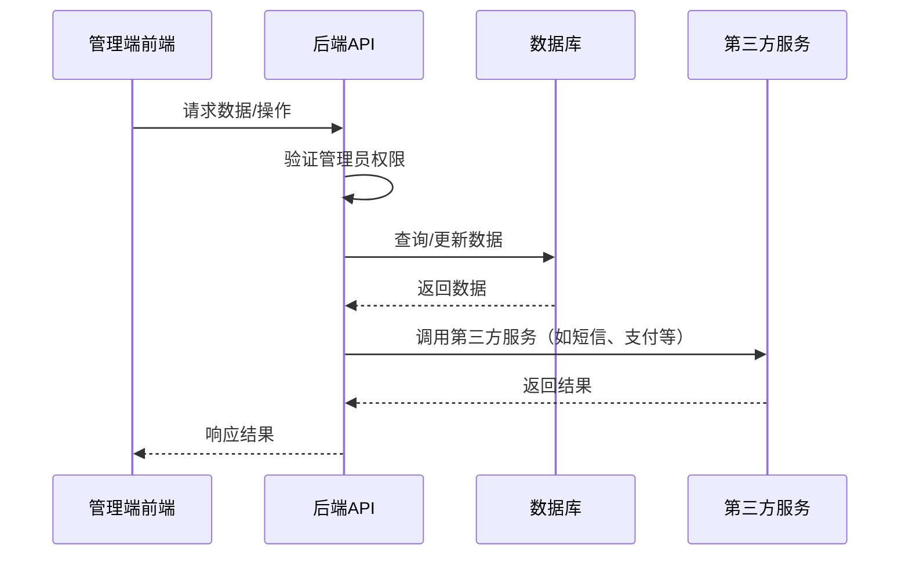

# 爱宠家管理端设计文档

## 1. 项目概述

爱宠家管理端是一个基于Web的后台管理系统，用于管理爱宠家宠物社区的用户、内容、商品、服务等各项业务。该系统采用前后端分离架构，提供直观、高效的管理界面。

## 2. 技术架构

### 2.1 技术栈

#### 2.1.1 前端
- **框架**：React 18
- **语言**：TypeScript
- **状态管理**：Redux Toolkit
- **UI组件库**：Ant Design Pro
- **路由**：React Router
- **HTTP客户端**：Axios
- **图表**：ECharts
- **构建工具**：Vite

#### 2.1.2 后端
- **框架**：Flask
- **认证**：JWT
- **权限控制**：基于角色的访问控制（RBAC）
- **ORM**：SQLAlchemy
- **数据库**：MySQL/SQLite
- **API文档**：Swagger/OpenAPI

### 2.2 架构设计



## 3. 目录结构

### 3.1 前端目录结构

```
admin/
├── public/              # 静态资源
├── src/
│   ├── components/      # 通用组件
│   │   ├── layout/      # 布局组件
│   │   ├── form/        # 表单组件
│   │   └── table/       # 表格组件
│   ├── pages/           # 页面
│   │   ├── dashboard/   # 仪表盘
│   │   ├── user/        # 用户管理
│   │   ├── content/     # 内容管理
│   │   ├── shop/        # 商城管理
│   │   ├── service/     # 服务管理
│   │   └── system/      # 系统设置
│   ├── services/        # API服务
│   │   ├── api.ts       # API基础配置
│   │   ├── auth.ts      # 认证服务
│   │   ├── user.ts      # 用户服务
│   │   ├── content.ts   # 内容服务
│   │   ├── shop.ts      # 商城服务
│   │   ├── service.ts   # 服务服务
│   │   └── system.ts    # 系统服务
│   ├── store/           # Redux状态管理
│   │   ├── slices/      # 状态切片
│   │   └── index.ts     # 状态配置
│   ├── utils/           # 工具函数
│   │   ├── request.ts   # 请求封装
│   │   └── auth.ts      # 认证工具
│   ├── types/           # TypeScript类型定义
│   ├── App.tsx          # 应用入口
│   ├── main.tsx         # 主入口
│   └── routes.tsx       # 路由配置
├── .eslintrc.js         # ESLint配置
├── .prettierrc.js       # Prettier配置
├── tsconfig.json        # TypeScript配置
├── vite.config.ts       # Vite配置
└── package.json         # 依赖配置
```

### 3.2 后端目录结构

```
backend/
├── app/
│   ├── api/
│   │   └── v1/
│   │       ├── admin/   # 管理端API
│   │       │   ├── __init__.py
│   │       │   ├── auth.py     # 管理端认证
│   │       │   ├── user.py     # 用户管理
│   │       │   ├── content.py  # 内容管理
│   │       │   ├── shop.py     # 商城管理
│   │       │   ├── service.py  # 服务管理
│   │       │   └── system.py   # 系统管理
│   │       └── ...             # 现有API
│   ├── models.py        # 数据模型
│   ├── admin.py         # 管理员相关
│   ├── config.py        # 配置文件
│   └── ...
└── ...
```

## 4. 核心功能模块

### 4.1 仪表盘

#### 4.1.1 功能描述
- 数据概览：显示用户数、帖子数、订单数、服务预约数等关键指标
- 趋势分析：展示用户增长、订单趋势、服务预约趋势等图表
- 系统状态：显示服务器运行状态、API响应时间等

#### 4.1.2 技术实现
- 使用ECharts绘制趋势图表
- 后端提供统计数据API
- 前端定期刷新数据（可配置刷新间隔）

### 4.2 用户管理

#### 4.2.1 功能描述
- 用户列表：查看所有用户信息，支持分页、搜索、筛选
- 用户详情：查看用户详细资料、宠物信息、历史操作
- 用户操作：禁用/启用用户、重置密码、编辑用户信息
- 批量操作：支持批量禁用/启用用户

#### 4.2.2 技术实现
- 前端使用Ant Design Pro的Table组件
- 后端提供用户管理API，支持分页、搜索
- 权限控制：只有管理员可以操作

### 4.3 内容管理

#### 4.3.1 功能描述
- 帖子管理：查看、审核、删除帖子，支持批量操作
- 评论管理：查看、删除评论
- 内容统计：查看热门帖子、活跃用户等统计信息
- 内容审核：设置帖子审核规则，处理待审核内容

#### 4.3.2 技术实现
- 前端使用表格和表单组件
- 后端提供内容管理API
- 支持按状态、时间等筛选内容

### 4.4 商城管理

#### 4.4.1 功能描述
- 商品管理：添加、编辑、删除商品，设置商品状态
- 订单管理：查看订单详情，处理订单状态，处理退款
- 库存管理：监控商品库存，设置库存预警
- 销售统计：查看销售数据，分析销售趋势

#### 4.4.2 技术实现
- 前端使用表单和表格组件
- 后端提供商城管理API
- 支持商品分类管理

### 4.5 服务管理

#### 4.5.1 功能描述
- 服务提供商管理：添加、编辑服务机构信息
- 服务项目管理：配置服务项目和价格
- 预约管理：查看和处理服务预约，管理预约状态
- 服务统计：分析服务预约数据，查看热门服务

#### 4.5.2 技术实现
- 前端使用表单和表格组件
- 后端提供服务管理API
- 支持服务类型分类管理

### 4.6 系统设置

#### 4.6.1 功能描述
- 系统配置：修改系统参数，如站点名称、联系方式等
- 权限管理：设置管理员权限，管理管理员账号
- 日志管理：查看系统日志，监控异常操作
- 数据备份：手动触发数据备份，查看备份历史

#### 4.6.2 技术实现
- 前端使用表单组件
- 后端提供系统管理API
- 支持权限分级管理

## 5. API设计

### 5.1 认证API

#### 5.1.1 登录
- **URL**：`/api/v1/admin/auth/login`
- **方法**：POST
- **参数**：
  - `username`：用户名
  - `password`：密码
- **响应**：
  - `token`：JWT令牌
  - `user`：管理员信息

#### 5.1.2 刷新令牌
- **URL**：`/api/v1/admin/auth/refresh`
- **方法**：POST
- **参数**：
  - `refresh_token`：刷新令牌
- **响应**：
  - `token`：新的JWT令牌

### 5.2 用户管理API

#### 5.2.1 获取用户列表
- **URL**：`/api/v1/admin/users`
- **方法**：GET
- **参数**：
  - `page`：页码
  - `page_size`：每页数量
  - `search`：搜索关键词
  - `status`：用户状态
- **响应**：
  - `users`：用户列表
  - `total`：总用户数

#### 5.2.2 获取用户详情
- **URL**：`/api/v1/admin/users/:id`
- **方法**：GET
- **响应**：
  - `user`：用户详情
  - `pets`：用户宠物列表

#### 5.2.3 更新用户状态
- **URL**：`/api/v1/admin/users/:id/status`
- **方法**：PUT
- **参数**：
  - `status`：用户状态（active/inactive）
- **响应**：
  - `success`：操作结果

### 5.3 内容管理API

#### 5.3.1 获取帖子列表
- **URL**：`/api/v1/admin/posts`
- **方法**：GET
- **参数**：
  - `page`：页码
  - `page_size`：每页数量
  - `search`：搜索关键词
  - `status`：帖子状态
- **响应**：
  - `posts`：帖子列表
  - `total`：总帖子数

#### 5.3.2 删除帖子
- **URL**：`/api/v1/admin/posts/:id`
- **方法**：DELETE
- **响应**：
  - `success`：操作结果

### 5.4 商城管理API

#### 5.4.1 获取商品列表
- **URL**：`/api/v1/admin/shop/products`
- **方法**：GET
- **参数**：
  - `page`：页码
  - `page_size`：每页数量
  - `search`：搜索关键词
  - `status`：商品状态
- **响应**：
  - `products`：商品列表
  - `total`：总商品数

#### 5.4.2 创建商品
- **URL**：`/api/v1/admin/shop/products`
- **方法**：POST
- **参数**：
  - `title`：商品标题
  - `description`：商品描述
  - `price_cents`：价格（分）
  - `stock`：库存
  - `images_json`：图片JSON
- **响应**：
  - `product`：创建的商品

### 5.5 服务管理API

#### 5.5.1 获取服务提供商列表
- **URL**：`/api/v1/admin/services/providers`
- **方法**：GET
- **参数**：
  - `page`：页码
  - `page_size`：每页数量
  - `search`：搜索关键词
  - `service_type`：服务类型
- **响应**：
  - `providers`：服务提供商列表
  - `total`：总提供商数

#### 5.5.2 创建服务提供商
- **URL**：`/api/v1/admin/services/providers`
- **方法**：POST
- **参数**：
  - `name`：提供商名称
  - `service_type`：服务类型
  - `description`：描述
  - `address`：地址
  - `cover_image`：封面图片
- **响应**：
  - `provider`：创建的服务提供商

### 5.6 系统管理API

#### 5.6.1 获取系统配置
- **URL**：`/api/v1/admin/system/config`
- **方法**：GET
- **响应**：
  - `config`：系统配置

#### 5.6.2 更新系统配置
- **URL**：`/api/v1/admin/system/config`
- **方法**：PUT
- **参数**：
  - `site_name`：站点名称
  - `contact_email`：联系邮箱
  - `contact_phone`：联系电话
- **响应**：
  - `success`：操作结果

## 6. 数据库设计

### 6.1 管理员表 (`admin_users`)

| 字段名 | 数据类型 | 描述 |
|-------|---------|------|
| `id` | `String(36)` | 主键 |
| `username` | `String(64)` | 用户名 |
| `password_hash` | `String(255)` | 密码哈希 |
| `name` | `String(64)` | 管理员姓名 |
| `role` | `String(32)` | 角色（admin/editor） |
| `status` | `String(32)` | 状态（active/inactive） |
| `created_at` | `DateTime` | 创建时间 |
| `updated_at` | `DateTime` | 更新时间 |

### 6.2 管理员日志表 (`admin_logs`)

| 字段名 | 数据类型 | 描述 |
|-------|---------|------|
| `id` | `String(36)` | 主键 |
| `admin_id` | `String(36)` | 管理员ID |
| `action` | `String(128)` | 操作类型 |
| `target_type` | `String(64)` | 操作目标类型 |
| `target_id` | `String(36)` | 操作目标ID |
| `ip` | `String(64)` | 操作IP |
| `user_agent` | `String(512)` | 用户代理 |
| `created_at` | `DateTime` | 操作时间 |

## 7. 前端实现

### 7.1 登录页面

#### 7.1.1 功能描述
- 管理员登录表单
- 支持用户名和密码登录
- 登录失败提示
- 记住密码功能

#### 7.1.2 技术实现
- 使用Ant Design Pro的Form组件
- 实现表单验证
- 调用登录API获取令牌
- 存储令牌到localStorage

### 7.2 布局组件

#### 7.2.1 功能描述
- 左侧导航菜单
- 顶部工具栏（用户信息、通知、退出）
- 面包屑导航
- 内容区域

#### 7.2.2 技术实现
- 使用Ant Design Pro的Layout组件
- 动态生成导航菜单（基于权限）
- 实现路由切换

### 7.3 表格组件

#### 7.3.1 功能描述
- 支持分页
- 支持排序
- 支持筛选
- 支持批量操作
- 支持导出

#### 7.3.2 技术实现
- 基于Ant Design Pro的Table组件封装
- 实现通用表格配置
- 支持自定义列和操作

### 7.4 表单组件

#### 7.4.1 功能描述
- 支持各种表单控件
- 支持表单验证
- 支持动态表单
- 支持文件上传

#### 7.4.2 技术实现
- 基于Ant Design Pro的Form组件封装
- 实现通用表单配置
- 支持自定义验证规则

## 8. 后端实现

### 8.1 认证实现

#### 8.1.1 JWT认证
- 使用Flask-JWT-Extended库
- 实现登录和刷新令牌接口
- 保护管理端API路由

#### 8.1.2 权限控制
- 实现基于角色的访问控制（RBAC）
- 定义管理员角色和权限
- 验证管理员权限

### 8.2 管理端API实现

#### 8.2.1 路由注册
- 使用Flask蓝图注册管理端API路由
- 应用JWT认证和权限控制

#### 8.2.2 业务逻辑
- 实现各模块的业务逻辑
- 处理数据验证和错误处理
- 记录管理员操作日志

### 8.3 数据访问

#### 8.3.1 ORM操作
- 使用SQLAlchemy ORM操作数据库
- 实现数据查询和更新
- 处理事务和错误

#### 8.3.2 数据验证
- 使用Flask-Marshmallow进行数据验证
- 定义请求和响应模式
- 处理验证错误

## 9. 部署与发布

### 9.1 前端部署

1. 构建前端应用：`npm run build`
2. 将构建产物部署到Web服务器（如Nginx）
3. 配置Nginx反向代理到后端API

### 9.2 后端部署

1. 安装依赖：`pip install -r requirements.txt`
2. 配置生产环境变量
3. 使用WSGI服务器（如Gunicorn）运行应用
4. 配置Nginx作为反向代理

### 9.3 安全配置

- 使用HTTPS加密传输
- 配置防火墙，限制访问IP
- 定期更新依赖包
- 实现API速率限制

## 10. 开发计划

### 10.1 阶段一：基础架构搭建

1. 前端项目初始化
2. 后端API框架搭建
3. 数据库设计和初始化
4. 认证系统实现

### 10.2 阶段二：核心功能开发

1. 仪表盘模块
2. 用户管理模块
3. 内容管理模块
4. 商城管理模块
5. 服务管理模块
6. 系统设置模块

### 10.3 阶段三：测试与优化

1. 功能测试
2. 性能优化
3. 安全测试
4. 文档完善

### 10.4 阶段四：部署与上线

1. 生产环境部署
2. 监控系统搭建
3. 上线测试
4. 运维文档编写

## 11. 技术挑战与解决方案

### 11.1 挑战：权限管理

**解决方案**：
- 实现基于角色的访问控制（RBAC）
- 细粒度的权限控制
- 权限继承和覆盖机制

### 11.2 挑战：数据安全

**解决方案**：
- 使用HTTPS加密传输
- 密码哈希存储
- 防止SQL注入和XSS攻击
- 定期数据备份

### 11.3 挑战：性能优化

**解决方案**：
- 数据库查询优化
- 缓存机制
- 异步处理
- 前端性能优化

### 11.4 挑战：可扩展性

**解决方案**：
- 模块化设计
- 微服务架构
- 配置化管理
- 插件系统

## 12. 监控与维护

### 12.1 系统监控

- 服务器状态监控
- API响应时间监控
- 错误日志监控
- 异常操作监控

### 12.2 日志管理

- 管理员操作日志
- 系统错误日志
- 访问日志
- 性能日志

### 12.3 定期维护

- 数据库备份
- 依赖包更新
- 安全补丁应用
- 性能优化

## 13. 总结

爱宠家管理端是一个功能完整、安全可靠的后台管理系统，为管理员提供了便捷的管理工具。通过采用现代化的技术栈和架构设计，系统具有良好的可扩展性和可维护性。

该管理端将帮助运营团队更高效地管理爱宠家宠物社区，提升用户体验，促进平台健康发展。
