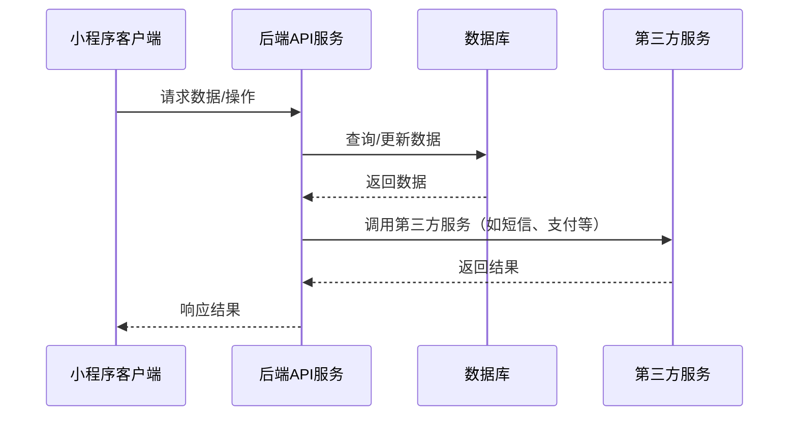

# 爱宠家宠物社区项目 Code Wiki

## 1. 项目概述

爱宠家是一个基于微信小程序的宠物社区应用，集社区交流、商品购买、宠物服务与个人中心于一体，提供流畅的内容浏览、互动与服务预约体验。

### 1.1 项目结构

```
├── PawHome/                # 小程序前端目录
│   ├── miniprogram/        # 小程序核心代码
│   │   ├── assets/         # 静态资源
│   │   ├── pages/          # 页面目录
│   │   ├── services/       # API服务封装
│   │   ├── config/         # 环境配置
│   │   ├── utils/          # 工具函数
│   │   ├── app.json        # 小程序配置
│   │   ├── app.ts          # 小程序入口
│   │   └── app.wxss        # 全局样式
│   └── typings/            # TypeScript类型定义
├── backend/                # 后端服务目录
│   ├── app/                # 应用核心
│   │   ├── api/            # API路由
│   │   ├── models.py       # 数据模型
│   │   └── config.py       # 配置文件
│   ├── instance/           # 实例数据
│   ├── scripts/            # 脚本工具
│   └── tests/              # 测试用例
└── UI设计/                 # 设计资源
```

## 2. 技术栈

### 2.1 前端
- 微信小程序原生框架
- TypeScript
- Vant Weapp/WeUI（可选）

### 2.2 后端
- Flask 微服务
- SQLAlchemy ORM
- SQLite/MySQL数据库

## 3. 系统架构

### 3.1 整体架构



### 3.2 前端架构

- **页面层**：负责用户界面展示和交互
- **服务层**：封装API调用，处理网络请求
- **工具层**：提供通用功能，如日期处理、验证等
- **配置层**：管理环境配置和常量

### 3.3 后端架构

- **API层**：处理HTTP请求，路由分发
- **服务层**：实现业务逻辑
- **数据层**：定义数据模型，处理数据持久化
- **配置层**：管理应用配置

## 4. 核心模块

### 4.1 前端模块

#### 4.1.1 主页模块 (`pages/home`)
- **功能**：展示轮播图、广告位、热门帖子，提供服务入口
- **关键文件**：
  - [index.ts](file:///workspace/PawHome/miniprogram/pages/home/index.ts)：页面逻辑
  - [index.wxml](file:///workspace/PawHome/miniprogram/pages/home/index.wxml)：页面结构
  - [index.wxss](file:///workspace/PawHome/miniprogram/pages/home/index.wxss)：页面样式

#### 4.1.2 社区模块 (`pages/community`)
- **功能**：浏览社区帖子，发布内容，互动评论
- **关键文件**：
  - [index.ts](file:///workspace/PawHome/miniprogram/pages/community/index.ts)：社区首页逻辑
  - [post-create/index.ts](file:///workspace/PawHome/miniprogram/pages/post-create/index.ts)：发布帖子
  - [post-detail/index.ts](file:///workspace/PawHome/miniprogram/pages/post-detail/index.ts)：帖子详情

#### 4.1.3 商城模块 (`pages/shop`)
- **功能**：浏览商品，购物车管理，下单支付
- **关键文件**：
  - [index.ts](file:///workspace/PawHome/miniprogram/pages/shop/index.ts)：商城首页
  - [detail.ts](file:///workspace/PawHome/miniprogram/pages/shop/detail.ts)：商品详情
  - [order/checkout.ts](file:///workspace/PawHome/miniprogram/pages/shop/order/checkout.ts)：订单结算

#### 4.1.4 服务模块 (`pages/service`, `pages/vaccine`)
- **功能**：宠物服务预约，疫苗记录管理
- **关键文件**：
  - [service/index.ts](file:///workspace/PawHome/miniprogram/pages/service/index.ts)：服务首页
  - [vaccine/record/index.ts](file:///workspace/PawHome/miniprogram/pages/vaccine/record/index.ts)：疫苗记录
  - [vaccine/appointment/index.ts](file:///workspace/PawHome/miniprogram/pages/vaccine/appointment/index.ts)：疫苗预约

#### 4.1.5 个人中心模块 (`pages/my`)
- **功能**：用户信息管理，宠物档案，订单管理
- **关键文件**：
  - [index.ts](file:///workspace/PawHome/miniprogram/pages/my/index.ts)：个人中心首页
  - [settings/index.ts](file:///workspace/PawHome/miniprogram/pages/my/settings/index.ts)：设置页面
  - [settings/pets/index.ts](file:///workspace/PawHome/miniprogram/pages/my/settings/pets/index.ts)：宠物管理

### 4.2 后端模块

#### 4.2.1 用户模块 (`app/api/v1/auth.py`, `app/api/v1/users.py`)
- **功能**：用户注册、登录、信息管理
- **关键类/函数**：
  - `User`：用户数据模型
  - `login`：用户登录接口
  - `register`：用户注册接口

#### 4.2.2 社区模块 (`app/api/v1/posts.py`, `app/api/v1/comments.py`)
- **功能**：帖子发布、浏览、评论管理
- **关键类/函数**：
  - `Post`：帖子数据模型
  - `Comment`：评论数据模型
  - `create_post`：创建帖子
  - `get_posts`：获取帖子列表

#### 4.2.3 商城模块 (`app/api/v1/shop.py`)
- **功能**：商品管理，订单处理，购物车操作
- **关键类/函数**：
  - `ShopProduct`：商品数据模型
  - `ShopOrder`：订单数据模型
  - `add_to_cart`：添加到购物车
  - `create_order`：创建订单

#### 4.2.4 服务模块 (`app/api/v1/services.py`, `app/api/v1/vaccines.py`)
- **功能**：服务预约，疫苗管理
- **关键类/函数**：
  - `ServiceProvider`：服务提供商
  - `ServiceAppointment`：服务预约
  - `VaccineRecord`：疫苗记录
  - `book_service`：预约服务

#### 4.2.5 消息模块 (`app/api/v1/im.py`, `app/api/v1/notifications.py`)
- **功能**：即时通讯，通知管理
- **关键类/函数**：
  - `IMConversation`：聊天会话
  - `IMMessage`：聊天消息
  - `Notification`：通知

## 5. 核心API

### 5.1 前端API服务

#### 5.1.1 基础请求封装 (`services/request.ts`)
- **功能**：封装微信小程序网络请求，处理认证和错误
- **关键函数**：
  - `request<T>`：通用请求函数，支持类型泛型

#### 5.1.2 认证服务 (`services/auth.ts`)
- **功能**：处理用户登录、注册等认证相关操作

#### 5.1.3 社区服务 (`services/posts.ts`)
- **功能**：处理帖子相关操作

#### 5.1.4 商城服务 (`services/shop.ts`)
- **功能**：处理商品和订单相关操作

#### 5.1.5 服务预约服务 (`services/petServices.ts`)
- **功能**：处理宠物服务预约相关操作

### 5.2 后端API接口

#### 5.2.1 认证接口 (`/api/v1/auth`)
- `POST /login`：用户登录
- `POST /register`：用户注册
- `POST /sms/code`：获取短信验证码

#### 5.2.2 社区接口 (`/api/v1/posts`)
- `GET /`：获取帖子列表
- `POST /`：创建帖子
- `GET /:id`：获取帖子详情
- `POST /:id/like`：点赞帖子
- `POST /:id/favorite`：收藏帖子

#### 5.2.3 评论接口 (`/api/v1/comments`)
- `GET /post/:post_id`：获取帖子评论
- `POST /`：创建评论
- `POST /:id/like`：点赞评论

#### 5.2.4 商城接口 (`/api/v1/shop`)
- `GET /products`：获取商品列表
- `GET /products/:id`：获取商品详情
- `POST /cart`：添加到购物车
- `GET /cart`：获取购物车
- `POST /orders`：创建订单
- `GET /orders`：获取订单列表

#### 5.2.5 服务接口 (`/api/v1/services`)
- `GET /providers`：获取服务提供商
- `GET /offerings`：获取服务项目
- `POST /appointments`：预约服务
- `GET /appointments`：获取预约列表

#### 5.2.6 疫苗接口 (`/api/v1/vaccines`)
- `GET /catalog`：获取疫苗目录
- `POST /records`：添加疫苗记录
- `GET /records`：获取疫苗记录
- `POST /reminders`：设置疫苗提醒

## 6. 数据模型

### 6.1 用户相关
- **User**：用户信息
- **Session**：用户会话
- **UserSettings**：用户设置
- **Pet**：宠物信息

### 6.2 社区相关
- **Post**：帖子
- **PostLike**：帖子点赞
- **PostFavorite**：帖子收藏
- **Comment**：评论
- **CommentLike**：评论点赞
- **Follow**：关注关系

### 6.3 商城相关
- **ShopProduct**：商品
- **ShopFavorite**：商品收藏
- **CartItem**：购物车项
- **ShopOrder**：订单
- **ShopOrderItem**：订单项

### 6.4 服务相关
- **ServiceProvider**：服务提供商
- **ServiceOffering**：服务项目
- **ServiceSlot**：服务时间槽
- **ServiceAppointment**：服务预约
- **VaccineCatalog**：疫苗目录
- **VaccineRecord**：疫苗记录
- **VaccineReminder**：疫苗提醒

### 6.5 消息相关
- **IMConversation**：聊天会话
- **IMMessage**：聊天消息
- **Notification**：通知

## 7. 项目运行

### 7.1 前端运行
1. 导入项目：使用微信开发者工具导入 `PawHome/miniprogram` 目录
2. 设置 `appid`：在 `project.config.json` 中替换为你的小程序 `appid`
3. 域名校验：开发阶段 `project.config.json` 已关闭 `urlCheck`
4. 运行预览：编译并预览，登录页支持验证码登录、微信登录与调试跳过

### 7.2 后端运行
1. 安装依赖：`pip install -r requirements.txt`
2. 初始化数据库：`python scripts/init_db.py`
3. 启动服务：`python run.py`
4. 测试API：`python scripts/smoke_api.py`

### 7.3 环境配置
- 前端接口地址：修改 `miniprogram/config/env.ts` 中的 `BASE_URL`
- 后端数据库配置：修改 `backend/.env` 文件中的 `DATABASE_URL`

## 8. 部署与发布

### 8.1 前端发布
1. 在微信开发者工具中构建小程序
2. 提交代码审核
3. 审核通过后发布

### 8.2 后端部署
1. 配置生产环境数据库
2. 设置环境变量 `FLASK_ENV=production`
3. 使用 WSGI 服务器（如 Gunicorn）运行应用
4. 配置 Nginx 作为反向代理

## 9. 开发规范

### 9.1 前端规范
- 使用 TypeScript 编写代码
- 页面文件使用 `.ts`、`.wxml`、`.wxss`、`.json` 结构
- 组件化开发，复用公共组件
- 遵循微信小程序开发最佳实践

### 9.2 后端规范
- 使用 Flask 蓝图组织 API 路由
- 采用 RESTful API 设计风格
- 使用 SQLAlchemy ORM 操作数据库
- 编写单元测试和集成测试

## 10. 常见问题与解决方案

### 10.1 前端问题
- **问题**：开发者工具报 "could not find ... index.js"
  **解决方案**：在页面目录添加 `index.js` 作为兼容入口

- **问题**：字体在真机上不生效
  **解决方案**：将字体转换为 `woff2` 并使用 `wx.loadFontFace` 远程加载

### 10.2 后端问题
- **问题**：数据库连接失败
  **解决方案**：检查数据库配置和网络连接

- **问题**：API 响应缓慢
  **解决方案**：优化数据库查询，添加缓存

## 11. 监控与维护

### 11.1 前端监控
- 使用微信开发者工具的调试功能
- 监控用户行为和错误日志

### 11.2 后端监控
- 日志记录系统运行状态
- 监控 API 响应时间和错误率
- 定期备份数据库

## 12. 未来规划

### 12.1 功能扩展
- 增加宠物社交功能
- 开发宠物健康管理系统
- 实现社区内容推荐算法

### 12.2 技术升级
- 前端使用小程序框架（如 Taro、UniApp）跨平台开发
- 后端使用容器化部署
- 引入更多 AI 功能提升用户体验

---

## 13. 管理端设计

### 13.1 管理端架构

管理端采用前后端分离架构，使用 React + TypeScript 开发前端，Flask 提供 API 接口。

```
├── admin/                # 管理端目录
│   ├── src/              # 前端源码
│   │   ├── components/   # 组件
│   │   ├── pages/        # 页面
│   │   ├── services/     # API服务
│   │   └── utils/        # 工具函数
│   ├── public/           # 静态资源
│   └── package.json      # 依赖配置
└── backend/              # 后端API（复用现有）
    └── app/api/v1/admin/ # 管理端API
```

### 13.2 核心功能模块

#### 13.2.1 仪表盘
- 数据概览：用户数、帖子数、订单数等关键指标
- 趋势分析：用户增长、订单趋势等图表
- 系统状态：服务器运行状态、API响应时间等

#### 13.2.2 用户管理
- 用户列表：查看所有用户信息
- 用户详情：查看用户详细资料、宠物信息
- 用户操作：禁用/启用用户、重置密码

#### 13.2.3 内容管理
- 帖子管理：查看、审核、删除帖子
- 评论管理：查看、删除评论
- 内容统计：热门帖子、活跃用户等

#### 13.2.4 商城管理
- 商品管理：添加、编辑、删除商品
- 订单管理：查看订单状态、处理退款
- 库存管理：监控商品库存

#### 13.2.5 服务管理
- 服务提供商管理：添加、编辑服务机构
- 服务项目管理：配置服务项目和价格
- 预约管理：查看和处理服务预约

#### 13.2.6 系统设置
- 系统配置：修改系统参数
- 权限管理：设置管理员权限
- 日志管理：查看系统日志

### 13.3 技术选型

#### 13.3.1 前端
- **框架**：React 18
- **语言**：TypeScript
- **状态管理**：Redux Toolkit
- **UI组件库**：Ant Design Pro
- **路由**：React Router
- **HTTP客户端**：Axios
- **图表**：ECharts

#### 13.3.2 后端
- **框架**：Flask
- **认证**：JWT
- **权限控制**：基于角色的访问控制（RBAC）
- **API文档**：Swagger/OpenAPI

### 13.4 开发计划

1. **需求分析与设计**：明确管理端功能需求，设计UI界面
2. **前端开发**：搭建项目框架，实现核心页面
3. **后端API开发**：实现管理端专属API接口
4. **集成测试**：测试前后端集成
5. **部署上线**：部署管理端应用

### 13.5 安全考虑

- 使用HTTPS加密传输
- 实现管理员认证和授权
- 防止SQL注入和XSS攻击
- 定期备份数据
- 监控异常访问

---

## 14. 附录

### 14.1 项目资源
- 接口文档：`输出文档/接口文档.yaml`
- 数据库表设计：`输出文档/数据库表设计.sql`
- ER与UML图：`输出文档/ER-图.puml`

### 14.2 开发工具
- 前端：微信开发者工具、VS Code
- 后端：PyCharm、VS Code
- 数据库：SQLite、MySQL Workbench

### 14.3 参考资料
- [微信小程序开发文档](https://developers.weixin.qq.com/miniprogram/dev/framework/)
- [Flask官方文档](https://flask.palletsprojects.com/)
- [SQLAlchemy文档](https://docs.sqlalchemy.org/)
